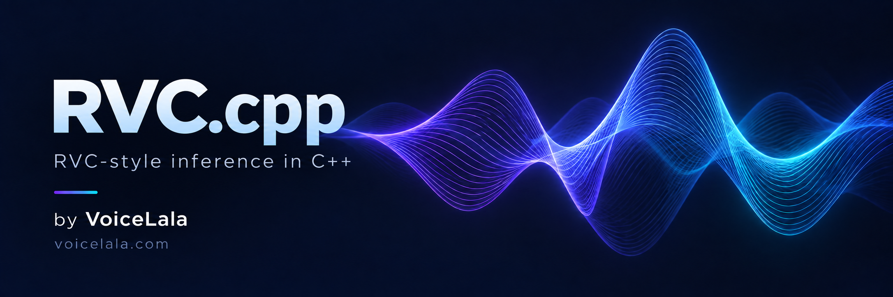

<p align="center">
  <a href="https://voicelala.com/">
    
  </a>
</p>

<h1 align="center">RVC.cpp</h1>
<p align="center"><strong>Conversión de voz de estilo RVC en C++ para tus aplicaciones.</strong></p>

<p align="center">
  <a href="https://github.com/VoiceLala/rvc-cpp/actions/workflows/ci.yml"></a>
  <a href="LICENSE"></a>
  
  
  <a href="https://voicelala.com/"></a>
</p>

[English](README.md) · [简体中文](README.zh-CN.md) · [日本語](README.ja.md) · [한국어](README.ko.md) · [Deutsch](README.de.md) · [Français](README.fr.md) · [Español](README.es.md) · [Português](README.pt.md)

---

RVC.cpp es una biblioteca de conversión de voz local basada en C++17 y ONNX Runtime. Conecta un codificador de contenido, un modelo F0 y un sintetizador de estilo RVC mediante una ABI de C. No requiere Python durante la inferencia.

Es una implementación independiente, no una versión oficial de RVC Project en C++ ni una adaptación completa del proyecto Python. Los símbolos de C, los objetivos de CMake y los ejecutables conservan el nombre `dvc` por compatibilidad. La documentación técnica detallada está actualmente principalmente en chino.

## Características

- **ABI de C**: rutas UTF-8, errores explícitos e integración mediante FFI.
- **Sin conexión y en flujo**: clips completos o bloques fijos con contexto, alineación SOLA y fundido cruzado.
- **Ajustes de voz**: tono, identificador de hablante, intensidad del ruido y semilla aleatoria.
- **Instancias independientes**: cada contexto mantiene sus sesiones y estado. Incluye CMake y un ejemplo de conversión WAV.

## Flujo de procesamiento

Del audio se extraen características de contenido y F0 que alimentan el modelo de síntesis. El modo en flujo añade contexto previo, SOLA y fundido cruzado. Consulta los tensores requeridos en el [contrato de modelos](docs/models.md).

## Compatibilidad

**0.1.0-dev es experimental.** La plataforma validada es Windows x64 con CPU. DirectML es una opción de compilación, pero su ejecución en GPU aún no está validada. Las pruebas con modelos sintéticos pasan; faltan por validar la calidad de voces reales, el rendimiento sostenido en tiempo real y la GPU. Consulta la [validación](docs/validation.md).

No se admiten actualmente Linux/macOS, CUDA, entrenamiento, carga directa de `.pth`, búsqueda FAISS `.index` ni gestión de dispositivos de audio. No incluye servidores HTTP, WebSocket o gRPC. Los modelos deben respetar las entradas y salidas documentadas; no todos los modelos exportados de RVC son intercambiables.

## Inicio rápido

Necesitas CMake 3.24+, un compilador C++17 y un SDK de ONNX Runtime con `include/` y `lib/`. Ejecuta los comandos desde una terminal de desarrollador x64 de Visual Studio.

```sh
git clone https://github.com/VoiceLala/rvc-cpp.git
cd rvc-cpp
```

```powershell
cmake -S . -B build -G Ninja -DCMAKE_BUILD_TYPE=Release -DONNXRUNTIME_ROOT=C:/sdk/onnxruntime
cmake --build build
Copy-Item C:/sdk/onnxruntime/lib/onnxruntime.dll build/
ctest --test-dir build --output-on-failure
```

Esta compilación utiliza CPU. Las pruebas predeterminadas no cargan modelos de voces reales. Para pruebas completas, DirectML e instalación, consulta la [guía de compilación](docs/build.md). Obtén por separado tres modelos compatibles.

```powershell
./build/dvc_wav.exe voice.onnx content.onnx pitch.onnx 40000 768 input.wav output.wav
```

`40000` indica la frecuencia de muestreo de salida del modelo de voz y `768` la dimensión de las características de contenido. Deben coincidir con el modelo. El ejemplo acepta WAV mono PCM16 / float32 de hasta 30 segundos y genera PCM16 sin sobrescribir archivos existentes. Por defecto usa CPU y hablante 0.

## Integración

Incluye `dvc/dvc.h`, inicializa la configuración con las funciones predeterminadas, crea un contexto y carga los modelos. Llama a `dvc_convert` o `dvc_process` y libera el contexto al terminar. Los errores se devuelven mediante códigos de estado y `dvc_last_error`, local al hilo. Serializa las llamadas a una misma instancia. `dvc_process` exige exactamente `config.block_size` muestras por llamada. La inferencia asigna memoria y se ejecuta de forma síncrona; usa un hilo de trabajo en vez del callback del dispositivo de audio. [API](docs/api.md).

## Licencia y contribuciones

Licencia [MIT](LICENSE). Los componentes de terceros conservan sus licencias; consulta los [avisos](THIRD_PARTY_NOTICES.md). Los pesos se obtienen por separado y están sujetos a sus propias licencias. Contribuciones: [CONTRIBUTING.md](CONTRIBUTING.md).

Gracias a [RVC Project](https://github.com/RVC-Project/Retrieval-based-Voice-Conversion-WebUI) y [ONNX Runtime](https://github.com/microsoft/onnxruntime).

## Descubre VoiceLala

Nuevas voces y efectos para juegos, transmisiones y chats de voz. [Visita VoiceLala →](https://voicelala.com/)

