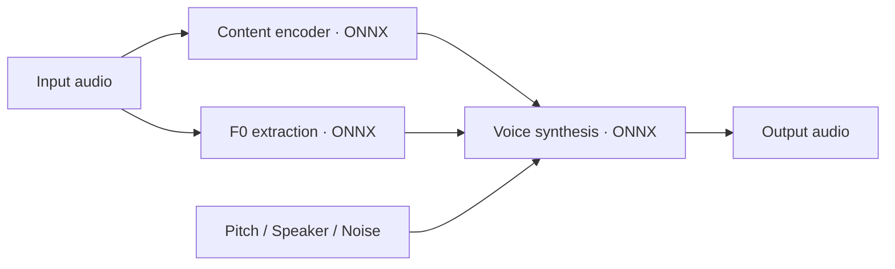

<p align="center">
  <a href="https://voicelala.com/">
    
  </a>
</p>

<h1 align="center">RVC.cpp</h1>
<p align="center"><strong>Bring AI voice conversion to your application.</strong></p>

<p align="center">
  <a href="https://github.com/VoiceLala/rvc-cpp/actions/workflows/ci.yml"></a>
  <a href="LICENSE"></a>
  
  
  <a href="https://voicelala.com/"></a>
</p>

[English](README.md) · [简体中文](README.zh-CN.md) · [日本語](README.ja.md) · [한국어](README.ko.md) · [Deutsch](README.de.md) · [Français](README.fr.md) · [Español](README.es.md) · [Português](README.pt.md)

---

RVC.cpp is a C++17 / ONNX Runtime library for developers integrating local voice conversion into their applications. It connects a content encoder, an F0 model and an RVC-style ONNX synthesizer behind a C ABI. Python is not required at inference time.

**Independent implementation:** RVC.cpp is a C++ inference library using an RVC-style model contract, not an official RVC Project release or a feature-complete port of its Python project. Existing C API symbols, CMake targets and example binaries retain the `dvc` name for compatibility. Detailed technical documentation is currently primarily in Chinese.

## Features

| Integrate | Process | Tune |
| :--- | :--- | :--- |
| **C ABI · C++17**<br>UTF-8 paths and explicit errors for FFI integration. | **Offline · Streaming**<br>Whole clips or fixed blocks with context, SOLA and crossfade. | **Pitch · Speaker**<br>Pitch shifting, speaker selection, noise scale and seed configuration. |

Each context owns its model sessions and inference state. Includes CMake integration and a WAV conversion example.

## From audio to voice



Streaming adds history, SOLA alignment and crossfade around block inference. See the [model contract](docs/models.md) for tensor requirements.

> **Want to try voice changing?** Explore [VoiceLala](https://voicelala.com/) for AI voice changing and soundboard effects in games, streams and voice chat.

## Compatibility

The current validation target is Windows x64 CPU. DirectML is an optional build path, not yet GPU-validated. Linux/macOS, CUDA, training, `.pth` loading, FAISS `.index` retrieval and audio-device management are not currently supported. Models must match the documented export protocol.

The library provides an in-process C API; no HTTP, WebSocket or gRPC server is included. **0.1.0-dev is experimental.** Synthetic graph tests pass; real-voice quality, sustained real-time performance and GPU execution remain to be validated. See the [validation notes](docs/validation.md).

## Quick start

```sh
git clone https://github.com/VoiceLala/rvc-cpp.git
cd rvc-cpp
```

Install CMake 3.24+, a C++17 compiler and an ONNX Runtime SDK containing `include/` and `lib/`. In an x64 Visual Studio developer terminal:

```powershell
cmake -S . -B build -G Ninja -DCMAKE_BUILD_TYPE=Release -DONNXRUNTIME_ROOT=C:/sdk/onnxruntime
cmake --build build
Copy-Item C:/sdk/onnxruntime/lib/onnxruntime.dll build/
ctest --test-dir build --output-on-failure
```

With three compatible, separately obtained models:

```powershell
./build/dvc_wav.exe voice.onnx content.onnx pitch.onnx 40000 768 input.wav output.wav
```

The two numbers specify the voice model's output sample rate and content feature dimension. The example accepts mono PCM16/float32 WAV up to 30 seconds and writes PCM16 without overwriting an existing file. See [model details](docs/models.md); arbitrary RVC ONNX exports are not interchangeable.

Include `dvc/dvc.h`, initialize configurations using the default functions, create a context, load models, call `dvc_convert` or `dvc_process`, and destroy the context. Errors are returned as status codes with thread-local details from `dvc_last_error`. Serialize calls to the same context. Streaming inference belongs on a worker thread, not an audio-device callback.

## License and acknowledgments

RVC.cpp is licensed under [MIT](LICENSE). Third-party components retain their own licenses; see [third-party notices](THIRD_PARTY_NOTICES.md). Model weights are obtained separately and remain subject to their respective licenses.

Thanks to [RVC Project](https://github.com/RVC-Project/Retrieval-based-Voice-Conversion-WebUI) and [ONNX Runtime](https://github.com/microsoft/onnxruntime). Contribution guidelines are in [CONTRIBUTING.md](CONTRIBUTING.md).

## Explore VoiceLala

Find a voice for your next game, stream or conversation.

**[Visit voicelala.com →](https://voicelala.com/)**
