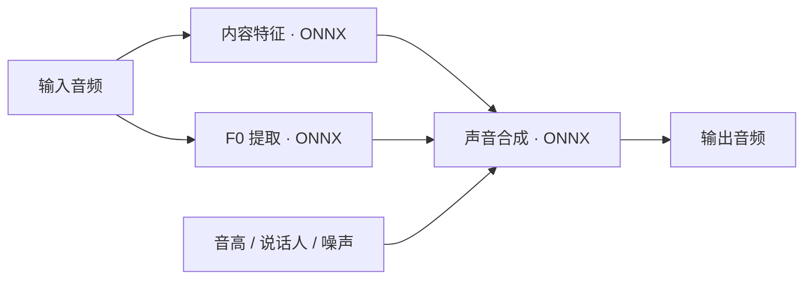

<p align="center">
  <a href="https://voicelala.com/">
    
  </a>
</p>

<h1 align="center">RVC.cpp</h1>
<p align="center"><strong>把 AI 变声接入你的应用。</strong></p>

<p align="center">
  <a href="https://github.com/VoiceLala/rvc-cpp/actions/workflows/ci.yml"></a>
  <a href="LICENSE"></a>
  
  
  <a href="https://voicelala.com/"></a>
</p>

[English](README.md) · [简体中文](README.zh-CN.md) · [日本語](README.ja.md) · [한국어](README.ko.md) · [Deutsch](README.de.md) · [Français](README.fr.md) · [Español](README.es.md) · [Português](README.pt.md)

---

RVC.cpp 是一个基于 C++17 和 ONNX Runtime 的声音转换库，面向需要集成本地音频转换与流式推理的开发者。它将内容特征提取、F0 提取和 RVC 风格声音合成连接成原生推理链路，通过 C ABI 供应用调用，推理运行时无需 Python。

**独立实现：** RVC.cpp 是采用 RVC 风格模型协议的 C++ 推理库，并非 RVC Project 的官方 C++ 版本，也不是完整 Python 项目的逐功能移植。为保持兼容，C API、CMake 目标和示例程序仍使用 `dvc` 名称。详细技术文档目前以中文为主。

## 为原生应用准备的声音转换

| 接入应用 | 处理音频 | 控制声音 |
| :--- | :--- | :--- |
| **C ABI · C++17**<br>UTF-8 模型路径、明确错误码，方便通过 FFI 调用。 | **离线 · 流式**<br>整段转换，或带上下文、SOLA 对齐与交叉淡化的分块处理。 | **音高 · 说话人**<br>配置升降调、speaker id、噪声强度与随机种子。 |

每个实例独立维护模型会话与推理状态。通过 CMake 集成，推理运行时无需 Python。

## 从输入到声音



流式模式在分块推理基础上加入历史上下文、SOLA 对齐和交叉淡化。三个模型的张量约定见 [模型协议](docs/models.md)。

> **想先体验变声？** 前往 [VoiceLala](https://voicelala.com/)，探索游戏、直播与语音聊天中的 AI 变声和音效玩法。

## 支持范围

| 能力 | 状态 |
|---|---|
| C ABI、独立实例、UTF-8 模型路径 | 已实现 |
| 三模型 ONNX 推理：content → F0 → voice | 已实现；模型需符合约定的输入输出协议 |
| 离线单声道 float32 音频转换 | 已实现，单次 20 ms–30 s；实际模型可能要求更长输入 |
| 固定块流式推理、历史上下文、SOLA、交叉淡化 | 已实现 |
| 升降调、speaker id、随机种子、noise scale | 已实现 |
| CPU | Windows x64 测试基线，见 [验证记录](docs/validation.md) |
| DirectML | 可选编译后端；GPU 运行尚未验收 |
| Linux / macOS | 未验收，不列为已支持平台 |

**当前不支持**直接加载 `.pth`、FAISS `.index` 检索、训练、CUDA、录音设备、虚拟麦克风、模型下载或一键兼容所有 RVC 导出器。RVC 风格推理并不等于实现了 RVC 的全部检索转换功能。

当前提供进程内 C API，未内置 HTTP、WebSocket 或 gRPC 服务。版本 `0.1.0-dev` 为实验版本，已通过合成模型功能测试；真实音色质量、持续实时性能及 GPU 运行仍待验证，详见 [验证记录](docs/validation.md)。

## 快速开始

```sh
git clone https://github.com/VoiceLala/rvc-cpp.git
cd rvc-cpp
```

需要 CMake 3.24+、C++17 编译器和 ONNX Runtime C/C++ SDK。Windows 建议使用 Visual Studio 的 x64 开发者终端。SDK 放到任意目录，例如 `C:/sdk/onnxruntime`，其中应有 `include/` 和 `lib/`。

```powershell
cmake -S . -B build -G Ninja -DCMAKE_BUILD_TYPE=Release -DONNXRUNTIME_ROOT=C:/sdk/onnxruntime
cmake --build build
Copy-Item C:/sdk/onnxruntime/lib/onnxruntime.dll build/
ctest --test-dir build --output-on-failure
```

这是 CPU 构建。完整测试、DirectML、安装和依赖版本见 [构建说明](docs/build.md)。上面的默认测试不加载真人音色。

自行准备符合 [模型协议](docs/models.md) 的三个 ONNX 模型，然后转换单声道 WAV：

```powershell
./build/dvc_wav.exe voice.onnx content.onnx pitch.onnx 40000 768 input.wav output.wav
```

`40000` 是**音色模型输出采样率**，`768` 是**内容特征维度**，必须与模型一致。输入支持 PCM16 / IEEE float32 WAV，输出为 PCM16 WAV，最长 30 秒；程序拒绝覆盖已存在的输出文件。命令行示例默认 CPU 和 speaker 0。

## 在应用中使用

```c
#include <dvc/dvc.h>
#include <stdio.h>

int convert_clip(const float* input, size_t count, float* output) {
    dvc_config config;
    dvc_default_config(&config); /* mono 48 kHz */
    dvc_context* context = NULL;
    dvc_status status = dvc_create(&config, &context);
    if (status != DVC_OK) return (int)status;

    dvc_model_config model;
    dvc_default_model_config(&model);
    model.voice_path = "voice.onnx";
    model.content_path = "content.onnx";
    model.pitch_path = "pitch.onnx";
    /* defaults: voice 40 kHz, features 768, one speaker */
    status = dvc_load_model(context, &model);
    if (status == DVC_OK) {
        size_t written = 0;
        status = dvc_convert(context, input, count, output, count, &written);
    }
    if (status != DVC_OK) fprintf(stderr, "%s\n", dvc_last_error());
    dvc_destroy(context);
    return (int)status;
}
```

流式调用使用 `dvc_process`，每次输入恰好 `config.block_size` 个样本。它会分配内存并同步执行推理，应放在工作线程中，由宿主的环形缓冲连接音频设备回调。同一实例的调用需由宿主串行化；不同实例拥有各自的模型会话和随机状态。

## 目录

```text
include/dvc/      公共 C 头文件
src/             推理、重采样与流式处理
examples/        WAV 转换示例
tests/           C ABI、模型协议与流式测试；测试模型生成器
cmake/           CMake 消费者包配置
docs/            构建、模型、API、设计与验证说明
licenses/        已确认的上游许可文本
scripts/         源码打包工具
```

模型权重由使用者自行准备。模型格式和张量约定见 [模型协议](docs/models.md)，组件职责见 [设计说明](docs/provenance.md)。

## 许可与贡献

本项目采用 [MIT 许可证](LICENSE)。第三方组件保留各自版权及许可，详见 [第三方声明](THIRD_PARTY_NOTICES.md)。模型权重遵循其各自的许可证。

欢迎先通过问题报告提供可复现的模型协议、构建或音频问题；贡献代码前请阅读 [CONTRIBUTING.md](CONTRIBUTING.md)。只使用你有权使用的模型和声音素材，不要在问题报告中上传未经允许的模型或私人录音。

## 致谢

- [RVC Project](https://github.com/RVC-Project/Retrieval-based-Voice-Conversion-WebUI)：RVC 声音转换项目。
- [ONNX Runtime](https://github.com/microsoft/onnxruntime)：原生模型执行引擎。

## 探索 VoiceLala

为游戏角色换一种声音，为直播增添音效，为语音聊天增加乐趣。

**[访问 voicelala.com →](https://voicelala.com/)**
